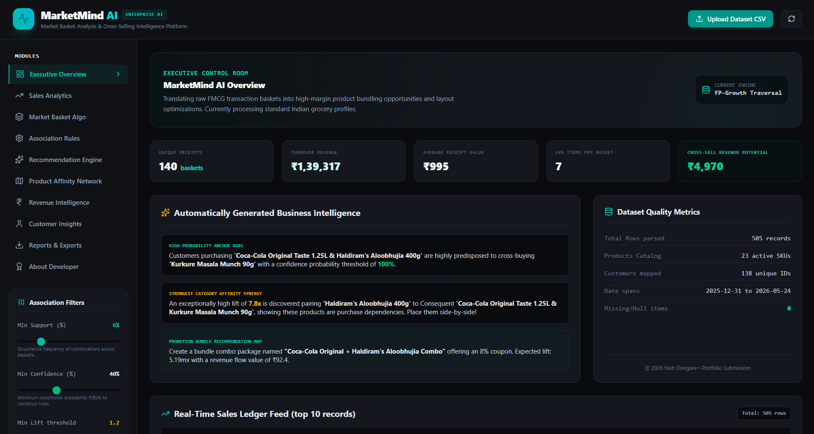
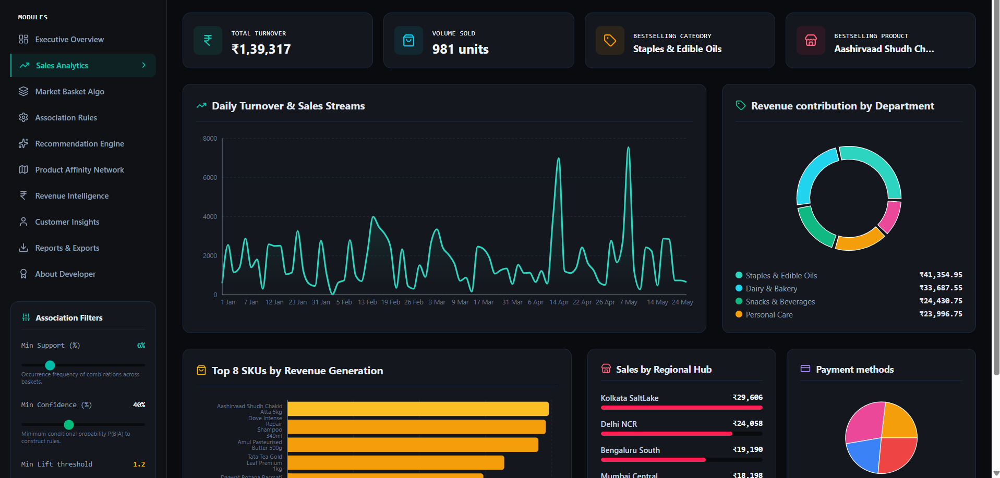
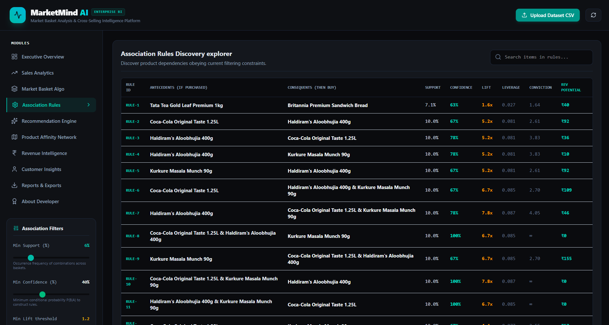
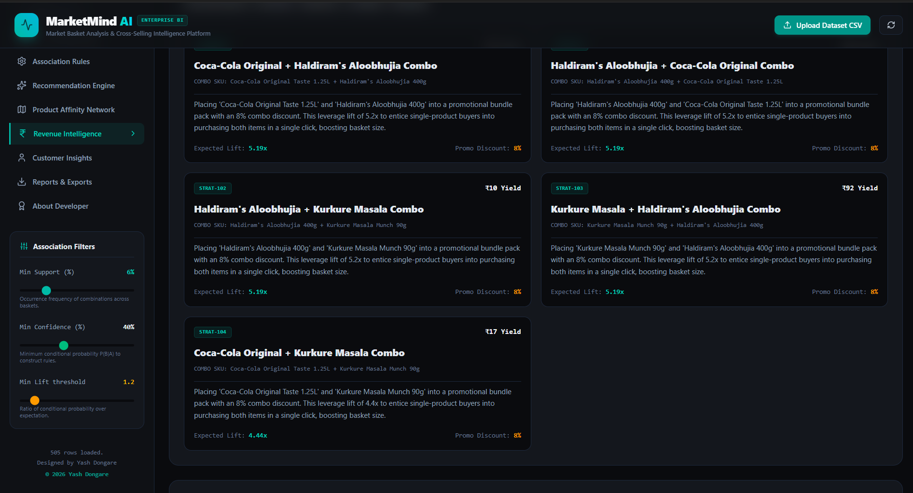

<div align="center">

<h1>🛡️ MarketMind AI</h1>

<h3>AI-Powered Market Basket Analysis Platform</h3>

<p>Developed during Internship at <b>Codec Technologies</b></p>

</div>

<hr>

<h2>📌 Project Overview</h2>

<p>
MarketMind AI is an AI-powered Market Basket Analysis platform that analyzes customer transaction data to identify purchasing patterns and product associations. The application helps businesses improve cross-selling strategies by discovering frequently purchased item combinations using machine learning and data mining techniques.
</p>

<hr>

<h2>✨ Features</h2>

<ul>
<li>Market Basket Analysis</li>
<li>Frequent Itemset Mining</li>
<li>Association Rule Generation</li>
<li>Product Recommendation System</li>
<li>AI-Powered Business Insights</li>
<li>Interactive Dashboard</li>
<li>Data Visualization</li>
<li>CSV Dataset Support</li>
<li>Fast Analytics</li>
<li>User-Friendly Interface</li>
</ul>

<hr>

<h2>🛠️ Technologies Used</h2>

<b>Frontend</b>

<ul>
<li>React.js</li>
<li>TypeScript</li>
<li>HTML5</li>
<li>CSS3</li>
<li>Vite</li>
</ul>

<b>Backend</b>

<ul>
<li>Node.js</li>
<li>Python</li>
</ul>

<b>Machine Learning</b>

<ul>
<li>Pandas</li>
<li>NumPy</li>
<li>Scikit-learn</li>
<li>Apriori Algorithm</li>
<li>FP-Growth Algorithm</li>
</ul>

<b>Artificial Intelligence</b>

<ul>
<li>Google Gemini AI</li>
</ul>

<hr>

<h2>📂 Project Structure</h2>

```text
marketmind-ai/
│
├── src/
├── public/
├── screenshots/
├── assets/
├── package.json
├── requirements.txt
├── README.md
└── LICENSE
```

<hr>

<h2>📸 Screenshots</h2>

<h3>Dashboard</h3>



<h3>Market Basket Analysis</h3>



<h3>Association Rules</h3>



<h3>Analytics</h3>



<hr>

<h2>🚀 Installation</h2>

Clone the repository

```bash
git clone https://github.com/YOUR_GITHUB_USERNAME/marketmind-ai.git
```

Navigate to the project

```bash
cd marketmind-ai
```

Install dependencies

```bash
npm install
```

or

```bash
pip install -r requirements.txt
```

Run the application

```bash
npm run dev
```

<hr>

<h2>💼 Internship Information</h2>

<b>Organization:</b> Codec Technologies

<p>
This project was developed as part of my internship to demonstrate practical implementation of Artificial Intelligence, Machine Learning, and Business Analytics concepts.
</p>

<hr>

<h2>📈 Future Enhancements</h2>

<ul>
<li>Real-time transaction analysis</li>
<li>Sales prediction</li>
<li>Customer segmentation</li>
<li>Personalized product recommendations</li>
<li>Cloud deployment</li>
<li>Mobile-responsive interface</li>
</ul>

<hr>

<h2>👨‍💻 Developer</h2>

<b>Yash Dongare</b><br>
B.Tech Computer Engineering<br>
Pimpri Chinchwad College of Engineering (PCCOE)

<hr>

<h2>📄 License</h2>

This project is licensed under the MIT License.

<hr>

<div align="center">

<b>⭐ If you like this project, consider giving it a Star ⭐</b>

</div>
